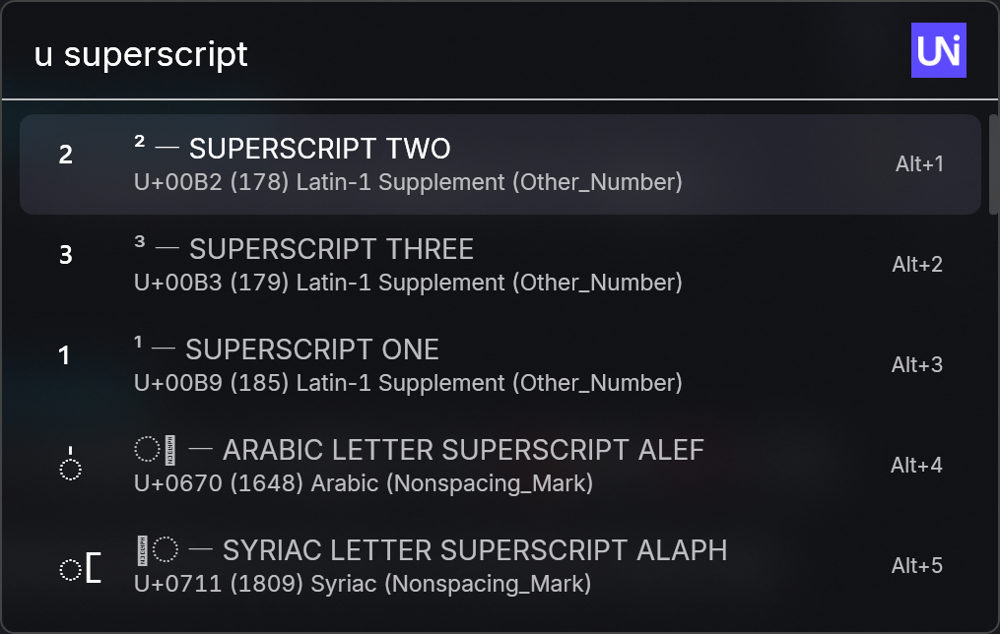
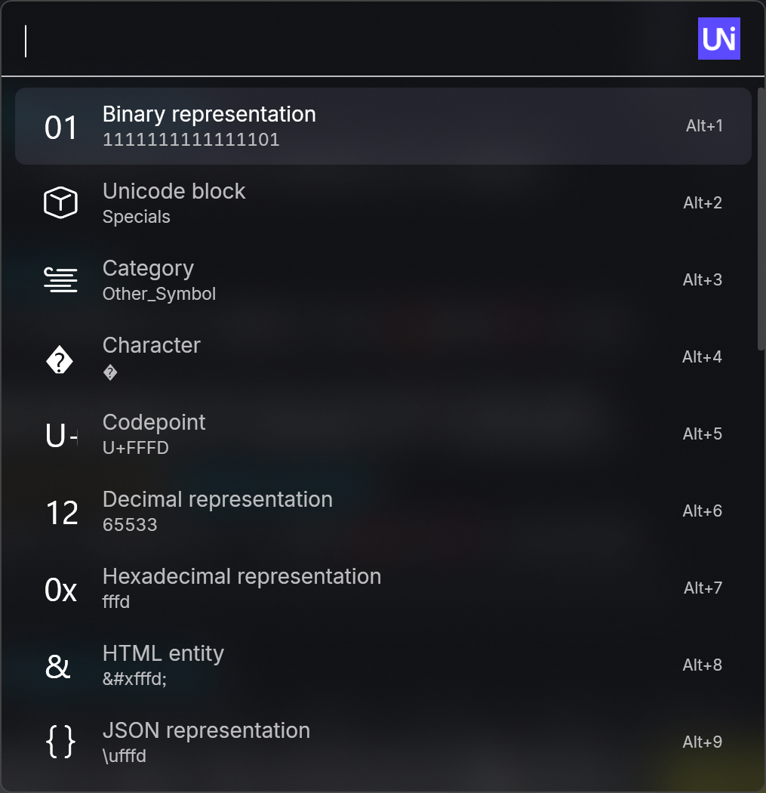
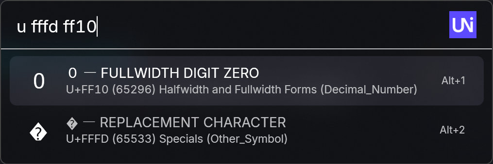
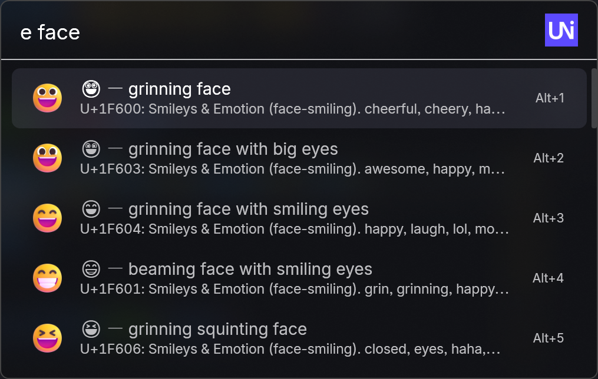
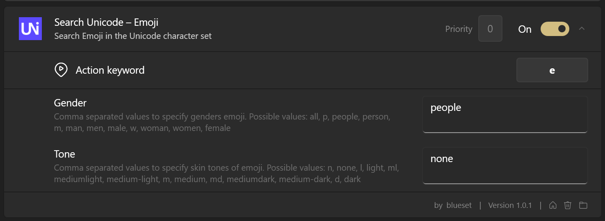
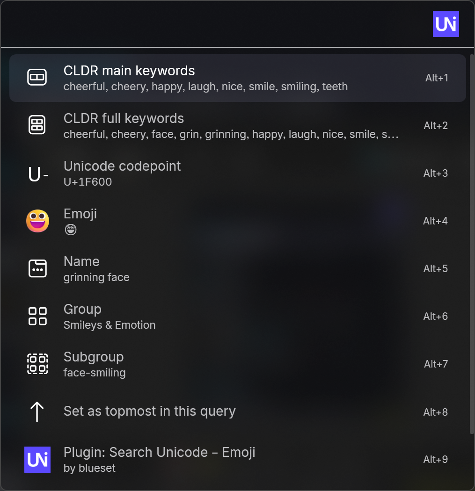
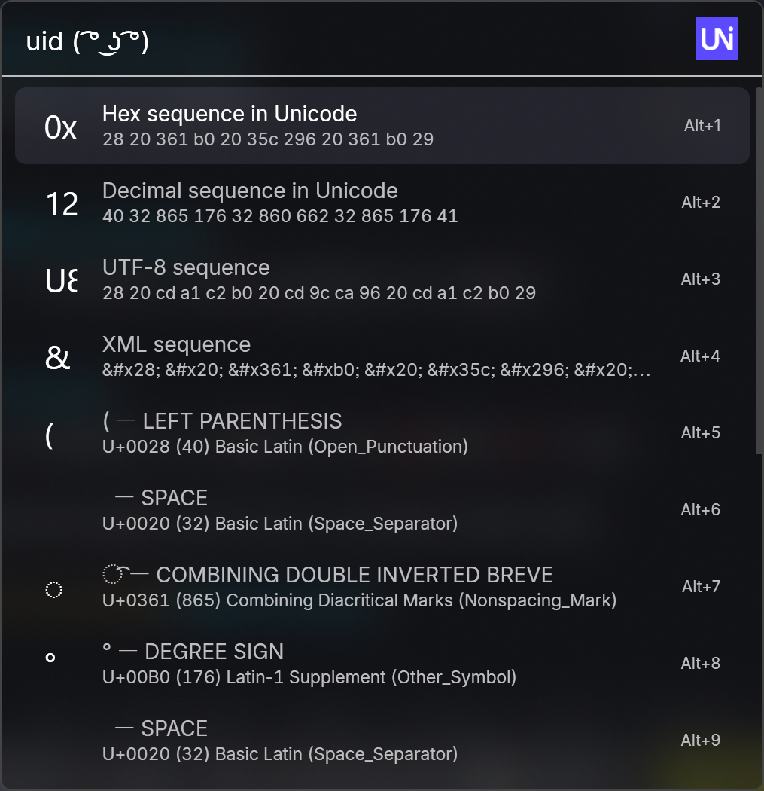

# Search Unicode

Search Unicode is a set of Flow Launcher plugins to lookup and reverse lookup Unicode characters and emoji with their names. This is a port of [Search Unicode for Alfred] workflows.

[Search Unicode for Alfred]: https://github.com/blueset/alfred-search-unicode/

## Install

You can install them directly from Flow Launcher using the `pm install` command.

```sh
pm install search unicode
```

Alternatively, you can download the latest release from the [releases page](https://github.com/blueset/flow-search-unicode/releases) and install it manually.

Unzip the content of the downloaded file to the Flow Launcher plugin directory at `%appdata%\FlowLauncher\Settings\Plugins\`, then restart your Flow Launcher.

## Usage

### Search character by description



Type `u keyword` (ex. `u superscript`) to get a list of characters
matching the keyword.

Press <kbd>Enter</kbd> to copy the character to clipboard (ex. `⁰`), press <kbd>→</kbd> to see and copy more information about the character.



### Search character by code point



Type `u codepoint [[codepoint] ...]` (ex. `u fffd ff10`) to look up characters by its codepoint.

### Search emoji by name



Type `e keywords` (ex. `e face`) to look up characters by its codepoint. Press <kbd>Enter</kbd> to copy the character to clipboard (ex. `😀`)

Additionally, you can choose your preferred emoji gender and skin tone in the workflow config. These settings are provided by `uni`. You can also search groups with `g:groupname` (ex. `e g:face-glasses`).



Press <kbd>Enter</kbd> to copy the character to clipboard (ex. `⁰`), press <kbd>→</kbd> to see and copy more information about the character.



### Identify characters in a string



Type `uid string` (ex. `uid ( ͡° ͜ʖ ͡°)`) to identify characters in a string.

Press <kbd>Enter</kbd> to copy the character to clipboard (ex. `⁰`), press <kbd>→</kbd> to see and copy more information about the character.


## Advanced search tips

### Search by keywords

#### Search full keywords

By default, each keyword separated by spaces is treated as a separate search term, and the search returns codepoints that match all the specified terms.

To search for an exact phrase, enclose the phrase in double quotes (`"`).

- `"mathematical double"` will return codepoints that match the exact phrase “mathematical double”, like “MATHEMATICAL DOUBLE-STRUCK CAPITAL A”
- `mathematical double` (without quotes) will return codepoints that match both “mathematical” and “double”, like “MATHEMATICAL LEFT DOUBLE ANGLE BRACKET”

#### Search in OR mode

You can perform an OR search by beginning the search query with `-or`.

- `-or arrow star` will return codepoints that match either “arrow” or “star”.

### Search codepoints by values

#### Search by exact codepoint values

You can search for Unicode codepoints by their values in various formats

- **Hexadecimal**:  `FFFD`, `U+FFFD`, `0xFFFD`, `%xFFFD`
- **Decimal**:  `0d65533`
- **Binary**:  `0b1111111111111101`
- **Octal**:  `0o177775`

#### Search ranges of codepoints

You can search for ranges of Unicode codepoints using two values separated by `..` or `-`

- `U+0041..U+005A`, `0x61-0x7A`, `0d48..0d57`

#### Search by UTF-8 byte sequences

You can search for codepoints by their UTF-8 byte sequences using the `utf8:` prefix followed by hexadecimal byte values.

- `utf8:EFBBBF` (for U+FEFF)
- `utf8:41` (for U+0041)

#### Combining multiple search patterns

You can combine multiple search patterns in a single query by separating them with spaces. For example:

- `U+0041 0b1100001 utf8:EFBBBF`
- `0x1F600..0x1F64F U+00A9 0d170`

## Credit

This workflow depends on resources from:

- [arp242/uni] 2.8.0 with Unicode 15.1, forked to [blueset/uni] for Unicode 16.
- [Fluent Emoji] for emoji preview

[arp242/uni]: https://github.com/arp242/uni
[blueset/uni]: https://github.com/blueset/uni/tree/fork
[Fluent Emoji]: https://github.com/microsoft/fluentui-emoji

## License

```plain
Copyright 2024 Eana Hufwe <https://1a23.com>

Permission is hereby granted, free of charge, to any person
obtaining a copy of this software and associated documentation
files (the “Software”), to deal in the Software without
restriction, including without limitation the rights to use,
copy, modify, merge, publish, distribute, sublicense, and/or sell
copies of the Software, and to permit persons to whom the
Software is furnished to do so, subject to the following
conditions:

The above copyright notice and this permission notice shall be
included in all copies or substantial portions of the Software.

THE SOFTWARE IS PROVIDED “AS IS”, WITHOUT WARRANTY OF ANY KIND,
EXPRESS OR IMPLIED, INCLUDING BUT NOT LIMITED TO THE WARRANTIES
OF MERCHANTABILITY, FITNESS FOR A PARTICULAR PURPOSE AND
NONINFRINGEMENT. IN NO EVENT SHALL THE AUTHORS OR COPYRIGHT
HOLDERS BE LIABLE FOR ANY CLAIM, DAMAGES OR OTHER LIABILITY,
WHETHER IN AN ACTION OF CONTRACT, TORT OR OTHERWISE, ARISING
FROM, OUT OF OR IN CONNECTION WITH THE SOFTWARE OR THE USE OR
OTHER DEALINGS IN THE SOFTWARE.
```
